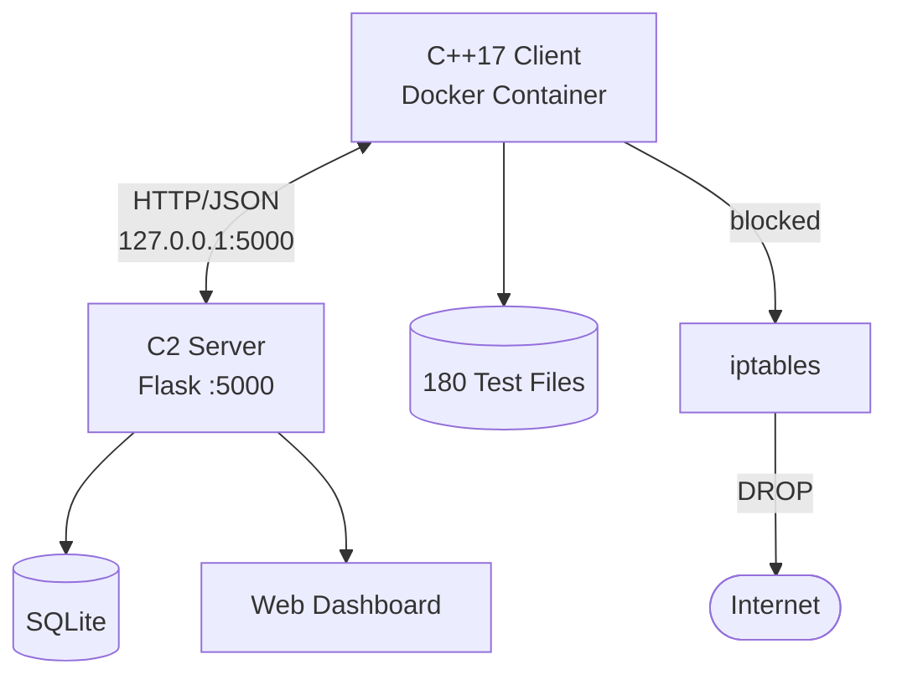
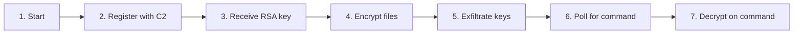

# Architecture

The simulator runs entirely on a single Kali Linux host. The ransomware client lives inside a Docker container with no external network access. The C2 server runs on loopback. iptables drops everything that tries to leave.

---

## System Overview



Communication between the client and C2 server is HTTP/JSON over `127.0.0.1:5000`. The Docker bridge network routes to the host gateway (`172.17.0.1`) which forwards to the loopback C2 server. Everything else is blocked at the firewall level - the container cannot reach DNS, cannot initiate external connections, and cannot exfiltrate data outside the host.

---

## Components

### Ransomware Client (C++17)

The simulation engine. Runs inside Docker and drives the attack lifecycle.

| Module | Responsibility |
|---|---|
| `core/` | Configuration, simulation orchestrator, file enumeration |
| `crypto/` | AES-256-GCM encryption, RSA-2048 key wrapping, secure memory |
| `network/` | HTTP client (libcurl), JSON protocol, C2 communication |
| `evasion/` | 12 anti-analysis modules (see [Evasion](evasion.md)) |
| `exploit/` | CVE privilege escalation modules |
| `persistence/` | Cron and systemd startup mechanisms |
| `research/` | Metrics collection, benchmarking, detection analysis |
| `ui/` | Ransom note generation |
| `dropper/` | Payload delivery simulation |

### C2 Server (Python / Flask)

Manages victim state, key storage, and operator commands.

| Endpoint | Method | Purpose |
|---|---|---|
| `/api/register` | POST | Victim registration, deliver RSA public key |
| `/api/exfiltrate` | POST | Receive wrapped AES keys |
| `/api/command` | GET | Command polling (encrypt / decrypt / idle) |
| `/api/status` | POST | Heartbeat |
| `/dashboard` | GET | Operator control panel |
| `/dashboard/victims` | GET | Active victim list |
| `/dashboard/keys` | GET | Key management |

### Docker Isolation

Multi-layer containment:

- **Network** - iptables drops all non-loopback egress; container has no internet access
- **Filesystem** - no host mounts; test files are generated inside the container
- **Process** - separate PID and network namespaces
- **Resources** - 512MB RAM cap, 1 CPU limit

---

## Attack Lifecycle



Each file gets its own randomly generated AES-256 key. Keys are wrapped with the C2's RSA public key before exfiltration, so recovery is impossible without the C2's RSA private key.

---

## Repository Structure (Private)

```
threat-simulation-capstone/
├── src/
│   ├── core/           # Simulation orchestrator and config
│   ├── crypto/         # AES-256-GCM + RSA-2048 + secure memory
│   ├── network/        # C2 client
│   ├── evasion/        # 12 anti-analysis modules
│   ├── exploit/        # CVE privilege escalation
│   ├── persistence/    # Startup persistence
│   ├── research/       # Metrics, comparison, detection analysis
│   ├── monitoring/     # Prometheus integration
│   └── ui/             # Payload note generation
├── include/            # Public headers
├── c2_server/          # Python Flask C2
├── tests/              # Unit and integration tests
├── benchmarks/         # Performance benchmarks
├── docker/             # Isolation environment
├── monitoring/         # Prometheus/Grafana stack
└── docs/               # Module guides, API reference, IR playbook
```
