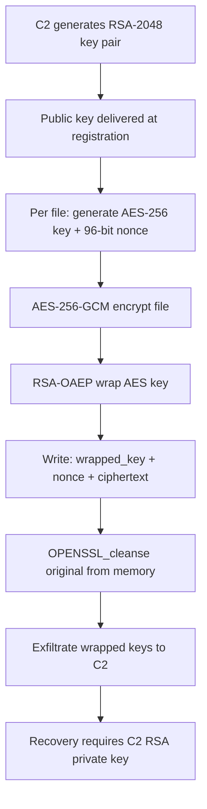
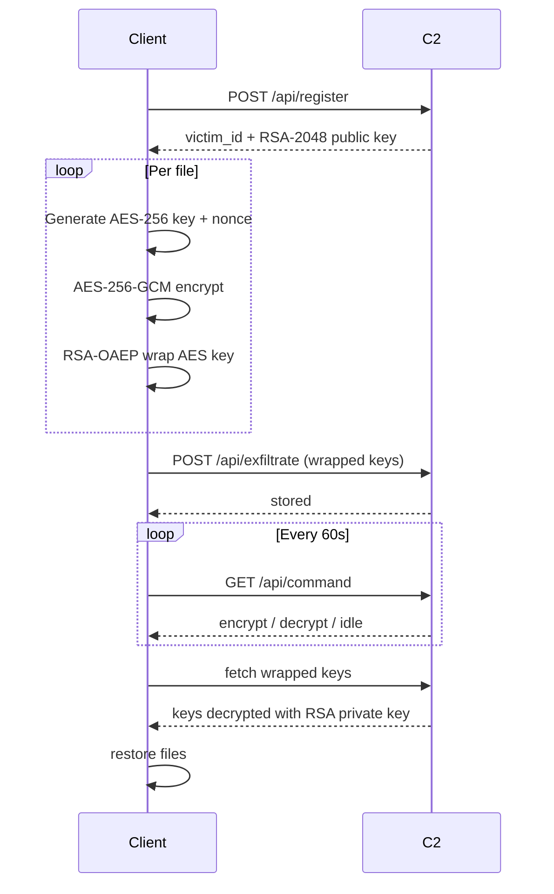

# Cryptography

The simulator implements a hybrid encryption scheme that mirrors what LockBit 3.0, Conti, and REvil use in production. RSA handles key transport. AES handles data. Per-file keys mean that cracking one file's key doesn't affect any other.

---

## Hybrid Encryption Scheme



---

## Encryption Flow



---

## Algorithms

| Layer | Algorithm | Key Size | Notes |
|---|---|---|---|
| Asymmetric | RSA-OAEP | 2048-bit | Key transport only |
| Symmetric | AES-GCM | 256-bit | Authenticated encryption |
| Nonce | CSPRNG | 96-bit | Unique per file |
| Auth tag | GCM | 128-bit | Detects tampering |

AES-GCM provides authenticated encryption - the auth tag means a modified ciphertext will fail decryption rather than producing corrupted plaintext. This is intentional and matches what real ransomware uses to prevent victims from tampering with encrypted files.

---

## Secure Memory Management

Key material is handled through RAII wrappers that call `OPENSSL_cleanse()` on destruction. Keys do not persist in memory after their scope exits.

```cpp
{
    Crypto::SecureKey256 key;            // 32-byte AES key on stack
    generate_key(key.data(), key.size());
    encrypt_file(path, key.to_vector());
}
// OPENSSL_cleanse() called automatically here
```

This mirrors documented behavior in LockBit 3.0 (`OPENSSL_cleanse`) and Conti (`SecureZeroMemory`). Forensic key recovery from a memory dump is not possible after scope exit.

---

## Intermittent Encryption

Modern ransomware families encrypt partially rather than fully - faster execution, lower CPU/disk usage, harder to detect behaviorally.

| Mode | Behavior | Detection Difficulty |
|---|---|---|
| `FULL` | Encrypt entire file | Baseline |
| `HEADER_ONLY` | First 4MB only | Higher - breaks headers, files appear corrupt |
| `INTERMITTENT` | Header + every 16th chunk | Highest - evades time and CPU behavioral rules |

With `INTERMITTENT` mode, randomized chunk intervals are supported to defeat static pattern analysis. This is the LockBit 3.0 technique documented in public threat intelligence reports.

---

## Ransomware Comparison

| Family | Symmetric | Asymmetric | Notes |
|---|---|---|---|
| This simulator | AES-256-GCM | RSA-2048 | |
| LockBit 3.0 | AES-256 | RSA-2048 | Intermittent encryption |
| Conti | AES-256 | RSA-4096 | Double extortion |
| REvil | Salsa20 | Curve25519 / ECDH | RaaS model |
| BlackCat | ChaCha20 | RSA-4096 | Written in Rust |
| Ryuk | AES-256 | RSA-4096 | Big game hunting |
| DarkSide | Salsa20 | RSA-1024 | Colonial Pipeline |
