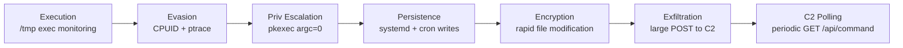

# Detection Engineering

Every offensive technique in this project has a corresponding detection artifact. YARA rules and Sigma rules are in [`detection-rules/`](../detection-rules/) and do not require code access.

---

## Detection by Attack Phase



---

## YARA Coverage

`detection-rules/yara/threat_simulation_behaviors.yar`

| Rule | What It Catches | ATT&CK |
|---|---|---|
| `FileEncryptionRapidModification` | `.encrypted`, `.locked`, `.enc` extensions | T1486 |
| `HybridEncryptionHeader` | RSA-wrapped AES key block at file offset 0 | T1486 |
| `C2RegistrationPattern` | `/api/register`, `/api/exfiltrate`, `victim_id` strings in memory | T1071.001 |
| `SecureMemoryWipePattern` | `OPENSSL_cleanse`, `SecureZeroMemory`, `explicit_bzero` | T1027 |
| `AntiVMCPUID` | `VMwareVMware`, `VBoxVBoxVBox`, `Microsoft Hv`, `KVMKVMKVM` | T1497.001 |
| `ProcessHollowingIndicator` | `ZwUnmapViewOfSection` + `WriteProcessMemory` + `ResumeThread` | T1055.012 |
| `RansomNoteCreation` | `README_DECRYPT`, `HOW_TO_DECRYPT`, `RECOVER_FILES` naming patterns | T1486 |

```bash
yara -r detection-rules/yara/threat_simulation_behaviors.yar /path/to/scan
```

---

## Sigma Coverage

`detection-rules/sigma/file_encryption_activity.yml`

| Rule | Trigger | Level |
|---|---|---|
| Rapid File Encryption | >50 file modifications in 60s by same process | High |
| C2 Registration POST | POST to `/api/register` on port 5000 | Medium |
| Anti-Debug ptrace | `ptrace(PTRACE_TRACEME)` syscall | Low |
| PwnKit SUID Execution | `pkexec` spawned from shell with argc=0 | High |
| Key Exfiltration POST | POST to `/api/exfiltrate` with body >10KB | High |

Convert to your SIEM:
```bash
sigmac -t splunk  detection-rules/sigma/file_encryption_activity.yml
sigmac -t elastic detection-rules/sigma/file_encryption_activity.yml
sigmac -t qradar  detection-rules/sigma/file_encryption_activity.yml
```

---

## auditd Rules

For Linux hosts, these auditd rules cover the privilege escalation and persistence phases:

```bash
# Dropper execution from common staging paths
-a always,exit -F arch=b64 -S execve -F path=/tmp -k dropper_exec
-a always,exit -F arch=b64 -S execve -F path=/dev/shm -k dropper_exec

# ptrace anti-debug
-a always,exit -F arch=b64 -S ptrace -k antidebug

# PwnKit (CVE-2021-4034)
-a always,exit -F arch=b64 -S execve -F path=/usr/bin/pkexec -k pwnkit

# Systemd persistence
-w /etc/systemd/system/ -p wa -k systemd_persistence
-w /lib/systemd/system/ -p wa -k systemd_persistence

# Cron persistence
-w /etc/crontab -p wa -k cron_persistence
-w /var/spool/cron/ -p wa -k cron_persistence
```

---

## eBPF Detection (Advanced)

The `anti_vm` CPUID queries can be caught with an eBPF kprobe on `native_cpuid`. This catches hypervisor fingerprinting before any file activity occurs - useful for detecting evasive samples that exit early if a VM is detected.

---

## Incident Response

The private repository includes a full incident response playbook covering:

- Containment steps per attack phase
- Evidence collection commands
- Recovery procedure (decrypt with C2 private key vs. restore from backup)
- Timeline reconstruction from logs and forensic artifacts
- Post-incident detection gap analysis

---

## MITRE ATT&CK Full Coverage

| Tactic | Techniques |
|---|---|
| Execution | T1059, T1204 |
| Persistence | T1547, T1543, T1053, T1542.003 |
| Privilege Escalation | T1068, T1548 |
| Defense Evasion | T1497.001, T1622, T1055.012, T1562.001, T1027, T1572, T1055, T1620 |
| Discovery | T1083, T1082 |
| Collection | T1005 |
| Command and Control | T1071.001, T1572 |
| Exfiltration | T1041 |
| Impact | T1486 |
